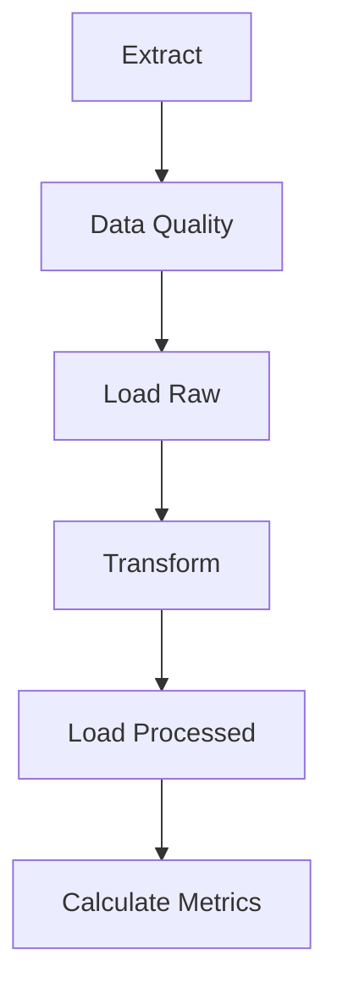
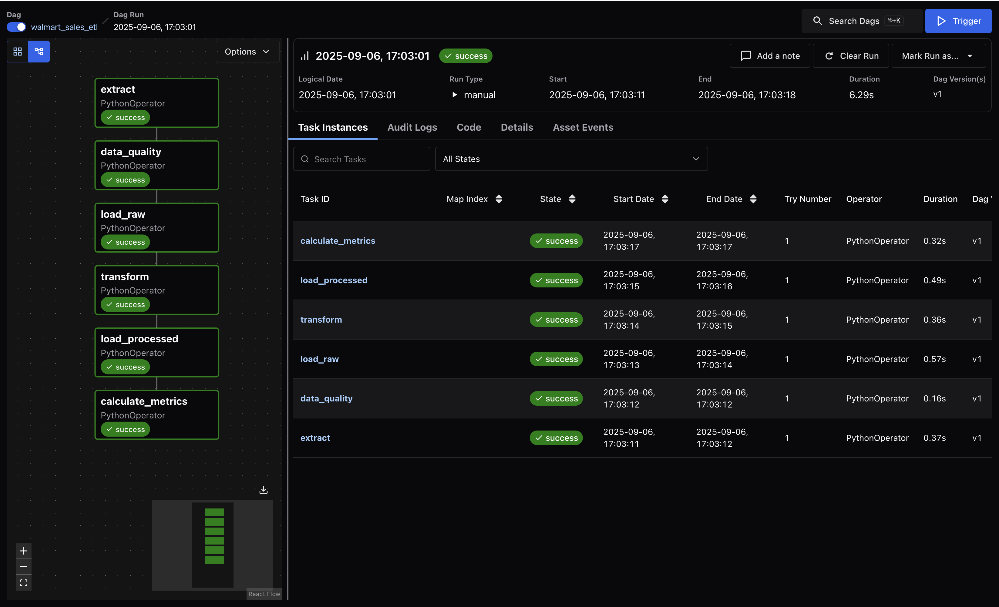
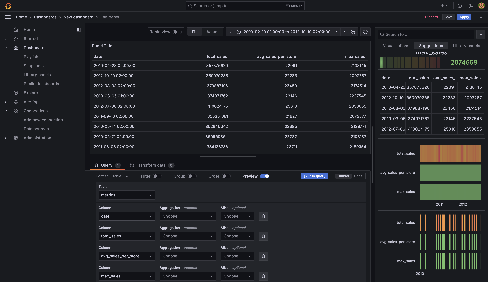

# Walmart Sales ETL Pipeline

##  Overview
This project implements a complete **ETL pipeline** for Walmart sales data using **Apache Airflow**.

The pipeline is designed as a portfolio project to demonstrate practical **data engineering skills**:
- Building modular ETL workflows  
- Orchestrating jobs with **Airflow**  
- Persisting data in **PostgreSQL**  
- Containerizing with **Docker Compose**  
- Adding CI/CD automation with **GitHub Actions**  
- (Optional) Visualizing metrics with **Grafana**  

---

##  Project Structure
```
├── airflow/                 # Airflow components
│   ├── dags/                # DAG definitions
│   │   └── dag_walmart.py
│   ├── etl/                 # ETL modules
│   │   ├── extract.py
│   │   ├── transform.py
│   │   ├── load.py
│   │   ├── metrics.py
│   │   └── quality.py
│   ├── sql/                 # SQL scripts for transformations & metrics
│   ├── data/                # Source dataset
│   │   └── walmart.csv
│   └── tests/               # Unit tests
├── db/                      # PostgreSQL init scripts
│   └── init.sql
├── grafana/                 # Grafana provisioning (optional)
├── docs/                    # Documentation & demos
│   └── screenshots/         # UI results
│       ├── airflow_ui.png
│       └── grafana_dashboard.png
├── docker-compose.yml       # Service orchestration
├── Dockerfile               # Custom Airflow image
├── requirements.txt         # Python dependencies
└── README.md

```

---

##  Tech Stack
- **Apache Airflow** – orchestration  
- **PostgreSQL** – database  
- **Docker / Docker Compose** – containerization  
- **GitHub Actions** – CI/CD  
- **Pytest** – testing  
- **Grafana** – visualization  (optional)

---

##  Getting Started

### 1. Clone repository
```bash
git clone https://github.com/dravindel/ecommerce-etl.git
cd ecommerce-etl
```

### 2. Create `.env` file
```env
POSTGRES_USER=airflow
POSTGRES_PASSWORD=airflow
POSTGRES_DB=airflow
AIRFLOW__CORE__FERNET_KEY=YOUR_KEY
```

### 3. Start services
```bash
docker-compose up --build -d
```

Access after startup:
- Airflow UI → [http://localhost:8080](http://localhost:8080)  
- Grafana (optional) → [http://localhost:3000](http://localhost:3000)  

---

##  ETL Pipeline

Steps in the DAG:
1. **Extract** → Load raw data (CSV → PostgreSQL).  
2. **Data Quality** → Validate input.  
3. **Load Raw** → Store unprocessed data.  
4. **Transform** → Clean & aggregate.  
5. **Load Processed** → Persist transformed data.  
6. **Metrics** → Calculate KPIs.  

DAG flow:


---

##  Tests
Run unit tests locally:
```bash
pytest airflow/tests/ --disable-warnings -q
```

---

##  CI/CD
- **CI (ci.yaml):** runs linting (flake8) and tests (pytest).  
- **CD (cd.yaml):** builds & pushes Airflow Docker image.  

To enable CD, add the following secrets in your GitHub repo:
- `DOCKER_USERNAME`  
- `DOCKER_PASSWORD`  

---

## Demo illustration

### Airflow DAG


### Grafana Dashboard


---

## Author
**👤 [Dravindel](https://www.linkedin.com/in/dmitrylakhov)**  
Portfolio project for **Data Engineering interviews demonstrations**.

