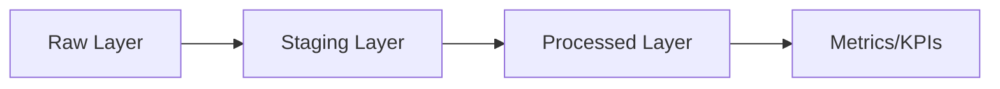
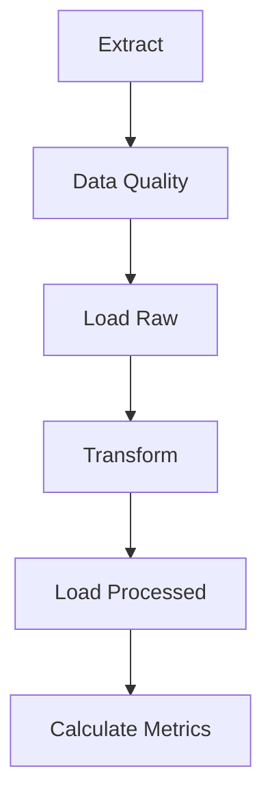

# Walmart Sales ETL Pipeline

##  Overview
This project implements a complete **ETL pipeline** for Walmart sales data using **Apache Airflow**.

The pipeline is designed as a portfolio project to demonstrate practical **data engineering skills**:
- Building modular ETL workflows  
- Orchestrating jobs with **Airflow**  
- Persisting data in **PostgreSQL**  
- Containerizing with **Docker Compose**  
- Adding CI/CD automation with **GitHub Actions**  
- Visualizing metrics with **Grafana**  

---

## Architecture

**Data Flow:**



- Raw Layer: Stores unprocessed, source data.
- Staging Layer (optional): Cleans, deduplicates, and enriches data for analytics. Can be implemented as an intermediate table (stg.orders) or handled in Python/SQL transformations before the processed layer.
- Processed Layer: Final business-ready tables, including calculated metrics and KPIs. This layer is ready for analytics, reporting, and dashboard consumption.
- Metrics Layer:Aggregated KPIs for dashboards and reporting. Typically stored in a separate table or materialized view to optimize queries for visualization tools like Grafana.

---

## Input Data

The pipeline processes aggregated sales data from walmart.csv with the following structure:
```
Store: INTEGER (Store ID)
Date: DATETIME (Date of sales data, format YYYY-MM-DD)
Weekly_Sales: FLOAT (Total weekly sales for the store)
Holiday_Flag: INTEGER (1 if the week includes a holiday, 0 otherwise)
Temperature: FLOAT (Average temperature in the region)
Fuel_Price: FLOAT (Average fuel price)
CPI: FLOAT (Consumer Price Index)
Unemployment: FLOAT (Unemployment rate)
```
---

##  Project Structure
```
walmart-etl-pipeline/
├── airflow/                         # Airflow components
│   ├── dags/                        # DAG definitions
│   │   ├── __pycache__/             # Compiled Python files
│   │   └── dag_walmart.py
│   ├── etl/                         # Python ETL modules
│   │   ├── __init__.py
│   │   ├── extract.py
│   │   ├── transform.py
│   │   ├── load.py
│   │   ├── metrics.py
│   │   └── quality.py
│   ├── data/                        # Source CSV files
│   │   └── walmart.csv
│   └── tests/                       # Unit and integration tests
│       ├── data_quality.py
│       └── test_etl.py
├── sql/                             # SQL scripts
│   ├── transform.sql                # Transformations for processed layer
│   └── metrics.sql                  # KPI / aggregate calculations
├── db/                              # Database initialization scripts
│   └── init.sql
├── grafana/                         # Dashboards setup
├── docs/                            # Documentation and demos
│   └── screenshots/
│       ├── airflow_ui.png
│       └── grafana_dashboard.png
├── requirements-airflow.txt         # Python dependencies for Airflow
├── docker-compose.yml               # Service orchestration
├── Dockerfile                       # Custom Airflow image
└── README.md                        # Project documentation

```

---

##  Tech Stack
- **Apache Airflow** – orchestration  
- **PostgreSQL** – database  
- **Docker / Docker Compose** – containerization  
- **GitHub Actions** – CI/CD  
- **Pytest** – testing  
- **Grafana** – visualization

---

##  Getting Started

### 1. Clone repository
```bash
git clone https://github.com/dravindel/ecommerce-etl.git
cd ecommerce-etl
```

### 2. Create `.env` file
```env
POSTGRES_USER=YOUR_USER
POSTGRES_PASSWORD=YOUR_PASSWORD
POSTGRES_DB=YOUR_DB
AIRFLOW__CORE__FERNET_KEY=YOUR_KEY
```

### 3. Start services
```bash
docker-compose up --build -d
```

Access after startup:
- Airflow UI → [http://localhost:8080](http://localhost:8080)
- PostgreSQL: Connect via psql -h localhost -p 5432 -U <YOUR_DB> -d <YOUR_USER>
- Grafana (optional) → [http://localhost:3000](http://localhost:3000)  
  
Verify services:

```bash
docker ps  # Check running containers
docker-compose logs airflow-webserver  # View Airflow logs if issues occur
```
---

##  ETL Pipeline

Steps in the DAG:
1. **Extract** → Load raw data (CSV → PostgreSQL).  
2. **Data Quality** → Validate input.  
3. **Load Raw** → Store unprocessed data.  
4. **Transform** → Clean & aggregate.  
5. **Load Processed** → Persist transformed data.  
6. **Metrics** → Calculate KPIs.  

## Error Handling and Logging

- Retries: Airflow tasks are configured with 3 retries and a 5-minute delay.
- Logging: Python logging is used in ETL modules (extract.py, transform.py, load.py) to track errors and progress.
- Data Quality: The quality.py module checks for nulls, duplicates, and invalid values (e.g., negative sales).

DAG flow:


---

## Metrics and Visualization

The pipeline calculates key performance indicators (KPIs) stored in the metrics table for Grafana dashboards. These metrics provide insights into sales trends, store performance, and external impacts

**Key Metrics**

- Total Sales: Sum of weekly sales across all stores (SUM(weekly_sales)).
- Average Sales per Store: Average sales normalized by the number of stores.
- Holiday Sales Increase: Difference between holiday-adjusted and regular sales.
- Max/Min Sales: Maximum and minimum weekly sales for outlier detection.
- Average Holiday Multiplier: Average multiplier applied during holidays.
- Average Unemployment Impact: Average impact of unemployment rate on sales.

---

##  Tests
Run unit tests locally:
```bash
pytest airflow/tests/ --disable-warnings -q
```

---

##  CI/CD
- **CI (ci.yaml):** runs linting (flake8), tests (pytest) and Docker image build validation..  
- **CD (cd.yaml):** builds & pushes Airflow Docker image.  

To enable CD, add the following secrets in your GitHub repo:
- `DOCKER_USERNAME`  
- `DOCKER_PASSWORD`  

---

## Demo illustration

### Airflow DAG


### Grafana Dashboard


---

## Author
**👤 [Dravindel](https://www.linkedin.com/in/dmitrylakhov)**  
Portfolio project for **Data Engineering skills demonstration**.
